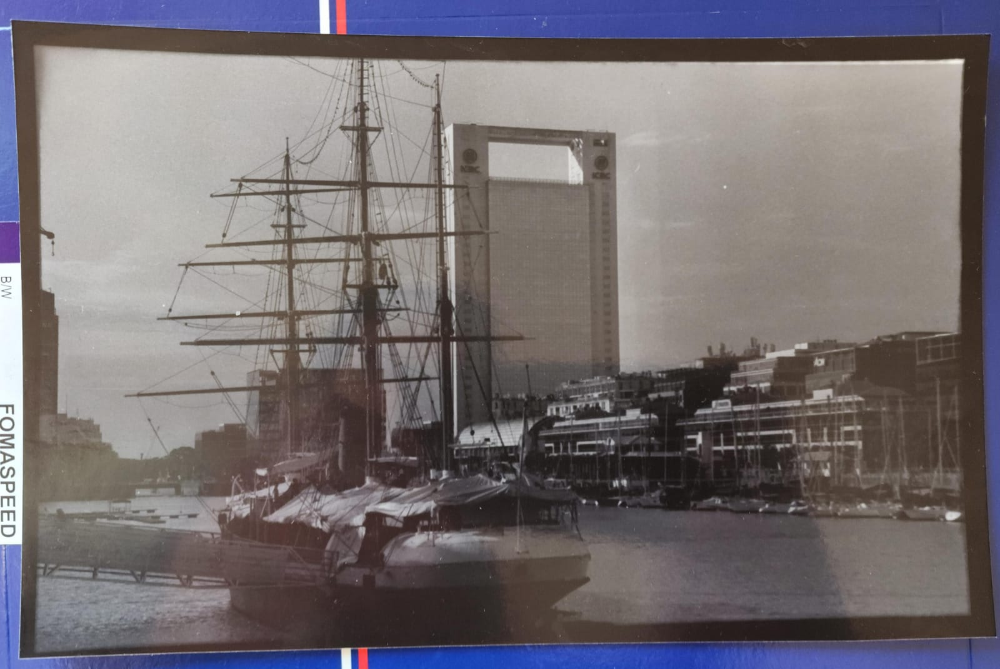

= Entrega de foto realizada en el laboratorio usando Tecnicas de Analogico II
:author: Ernesto Bossi
:revdate: 2025-09-06
:doctype: report

== Materiales

* Película: Fomapan 200
* Filtros de contraste: +3 y +1
* Tiempo base de exposición: 6 segundos

== Procedimiento

Decidí utilizar una fotografía tomada con Fomapan 200 para este examen. Empecé con un filtro +3, realicé una tira de prueba y establecí 6 segundos como tiempo base de exposición.

Tras la primera medición, cambié al filtro +1 para crear una máscara que separara el cielo del resto de la imagen —el muelle, el barco y los edificios—.

Con los 6 segundos y el filtro +3 como referencia, calculé el tiempo adecuado para este filtro y opté por quemar ligeramente el cielo. Para ello, utilicé la máscara con un tiempo adicional de 1,5 segundos con filtro +1.

Finalmente, apliqué la máscara y realicé un borde negro alrededor de la copia terminada.

